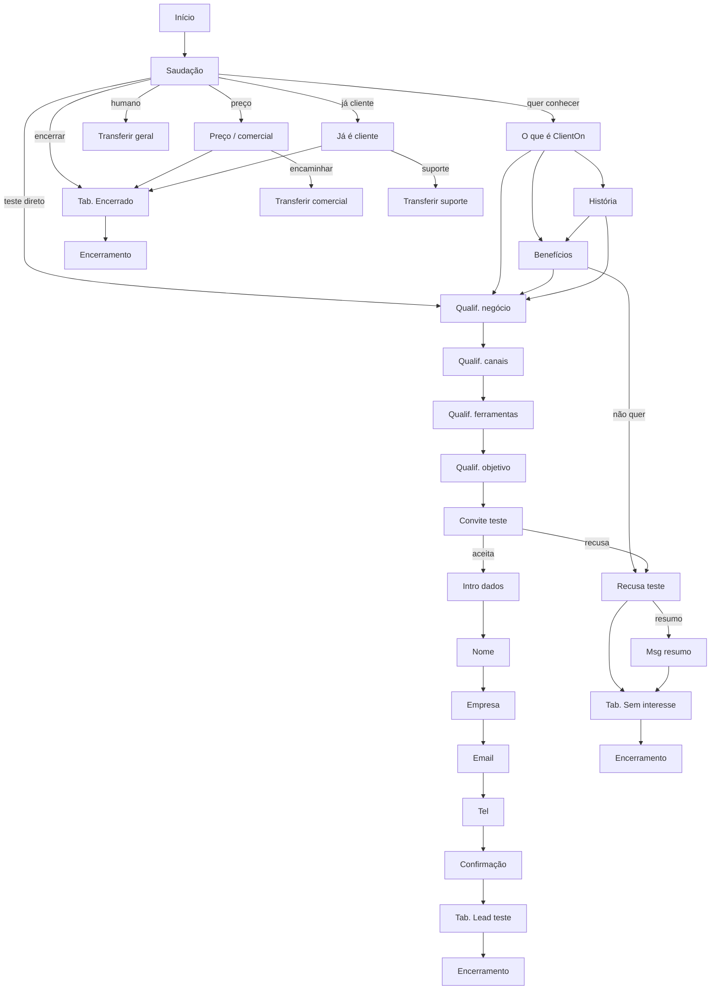

# Fluxo Cleo — Apresentação + Convite para teste (WhatsApp)

Fluxo comercial disparado principalmente pela resposta a um template de convite via WhatsApp.

## Aplicar no ambiente

```bash
cd mvp-fluxo-backend
npm run seed:cleo-flow
```

Variáveis opcionais:

| Variável | Descrição |
|----------|-----------|
| `SEED_FLOW_ID` | UUID do fluxo existente (padrão: busca por nome "Fluxo Cleo") |
| `SEED_PERSONA_ID` | UUID da persona Cleo |
| `DEFAULT_LOGIN_TENANT_ID` | Tenant (padrão: dev `00000000-0000-4000-8000-000000000001`) |

O script:

1. Cria/atualiza tabulações do tenant.
2. Remove nodes antigos do fluxo e insere o grafo completo.
3. Grava o prompt global em `flows.ai_settings`.
4. Ativa o fluxo (`is_active = true`).

Prompt global: `mvp-fluxo-backend/scripts/data/cleo-global-prompt.ts`.

## Mapa do fluxo



## Ramificações cobertas

| Situação | Caminho |
|----------|---------|
| Curiosidade / o que é | Saudação → O que é → Benefícios ou História |
| Interesse em teste | Qualificação (4 perguntas) → Convite → Coleta de dados |
| Aceita teste | Nome → Empresa → E-mail → Telefone → Confirmação → Tab. **Lead teste ClientOn** → Encerramento com protocolo |
| Não quer teste | Recusa → opcional resumo → Tab. **Sem interesse no teste** |
| Preço / prazo / comercial | Etapa dedicada → Transferir **Comercial** ou encerrar |
| Pediu humano / insatisfeito | Transferir **Geral** (atalho em todas as etapas Conversa) |
| Já é cliente | Etapa dedicada → Transferir **Suporte** ou encerrar |
| Encerrar / despedida | Tab. **Encerrado** → Encerramento |

## Nodes (28)

- **1** início  
- **12** conversa (IA), incluindo 1 nó global de atalhos  
- **4** receber_mensagem (coleta de lead)  
- **3** mensagem  
- **3** tabulação  
- **3** encerramento  
- **3** transferir_agente  

## Configuração complementar

1. **Persona Cleo** em Admin → IA (tom acolhedor, pt-BR).
2. **Bases de conhecimento** — vincular em Config. IA do fluxo quando houver conteúdo comercial/técnico.
3. **Rota inbound** — canal WhatsApp/Twilio deve apontar para o Fluxo Cleo.
4. **Filas** — Geral, Comercial e Suporte devem existir no tenant (ou ajustar nomes nos nodes de transferência).
5. **Template de encerramento** — em Operação → Configurações de serviço (mensagem com protocolo CLI-*).

## Comportamento do executor

Transições entre nodes **Conversa** avançam corretamente após a resposta do cliente: a Cleo envia a mensagem da etapa atual e, se houver transição, o fluxo segue para o próximo node na mesma execução (ex.: qualificação em cadeia).
